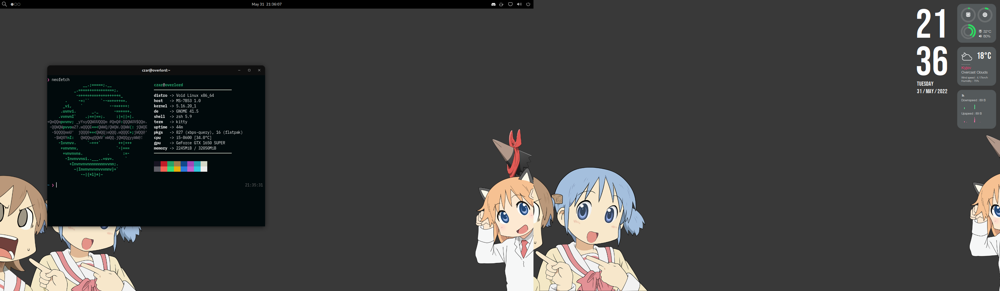

** **
 
###### Shell
zshell + [oh-my-zsh](https://ohmyz.sh/) + [powerlevel10k](https://github.com/romkatv/powerlevel10k)

###### Font
* **Terminal:** [IBM Plex Nerd Patch (BlexMono)](https://www.nerdfonts.com/font-downloads)
* **Desktop:** Cantarell

###### Looks

| Elements | Theme | Tweaks |
| --- | --- | --- |
| GTK | [Graphite Dark](https://www.pling.com/p/1598493) | Rimless, Normal, Black, Compact |
| Icons | [WhiteSur](https://www.pling.com/p/1405756) | Black panel, Bold |
| Cursors | [phinger-cursors](https://www.pling.com/p/1690782) | *None* |
| Shell | *Same as GTK*, [^^^](https://www.pling.com/p/1598493) | *^^^* |

###### Other
* **Display manager:** LightDM w/ GTK3 greeter
* **Screensaver & locker:** light-locker
* **Misc:** pavucontrol-qt, caffeine-ng, tint2, conky, picom
* **Gnome version:** 41.5
* **Gnome extensions:**
  - [Appindicator support](https://extensions.gnome.org/extension/615/appindicator-support/)
  - [Application Volume Mixer](https://extensions.gnome.org/extension/3499/application-volume-mixer/)
  - [ArcMenu](https://extensions.gnome.org/extension/3628/arcmenu/)
  - [Just Perfection](https://extensions.gnome.org/extension/3843/just-perfection/)
  - [Rounded System Menu Buttons](https://extensions.gnome.org/extension/4693/rounded-system-menu-buttons/)
  - [Sound Input & Output Device Chooser](https://extensions.gnome.org/extension/906/sound-output-device-chooser/)
  - [User Themes](https://extensions.gnome.org/extension/19/user-themes/)
  - [Workspace indicator](https://extensions.gnome.org/extension/3952/workspace-indicator/)
  - [Removable Drive Menu](https://extensions.gnome.org/extension/7/removable-drive-menu/)
  - [Remove Alt+Tab Delay v2](https://extensions.gnome.org/extension/2741/remove-alttab-delay-v2/)

** **

