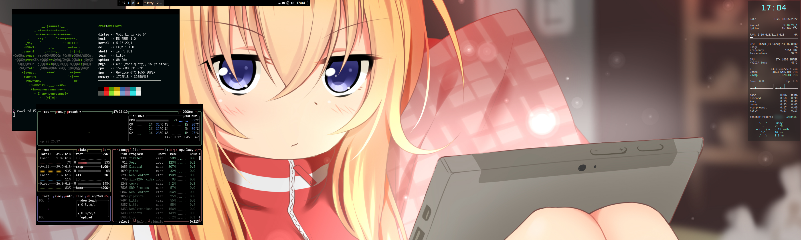

 
Personal configurations for my main desktop, powered by Void Linux

** **

###### Shell
zshell + [oh-my-zsh](https://ohmyz.sh/) + [powerlevel10k](https://github.com/romkatv/powerlevel10k)

###### Font
* **Terminal:** [IBM Plex Nerd Patch (BlexMono)](https://www.nerdfonts.com/font-downloads)
* **Conky** Liberation Mono + CP Mono
* **Desktop:** SF Pro Display

###### Themeing
* **GTK:** ----------| [Graphite Dark (Tweaks: Rimless, Normal, Black, Compact)](https://www.pling.com/p/1598493)
* **Icons:** ---------| [Qogir-dark](https://www.pling.com/p/1296407)
* **Cursors:** -----| [phinger-cursors](https://www.pling.com/p/1690782)
* **Openbox:** ----| [MYthos](hhttps://www.pling.com/p/1017804)
* **LXQt:** ----------| [Black Beauty](https://www.pling.com/p/1679919)

###### Other
* **Display manager:** LightDM w/ GTK3 greeter
* **Screensaver & locker:** light-locker
* **Misc:** pavucontrol-qt, caffeine-ng

** **

 

### LXQt Desktop Screenshot (main)

