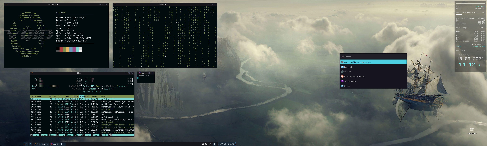

# dotfiles

[](https://forthebadge.com) 
[](https://forthebadge.com) 
[](https://forthebadge.com) 
[](https://forthebadge.com)

<br/>
Personal configurations for my main desktop, powered by Void Linux

###### Shell
```
zshell + oh-my-zsh + powerlevel10k

https://ohmyz.sh/
https://github.com/romkatv/powerlevel10k
```

###### Font
```
Terminal: IBM Plex Nerd Patch (BlexMono)
Conky + i3lock: Liberation Mono
Desktop: Liberation Sans

https://www.nerdfonts.com/font-downloads
```

###### Themes
```
Kripton          | GTK:     | https://www.pling.com/p/1365372
Blue-Zafiro-Plus | Icons:   | https://www.pling.com/p/1412411
Phinger-cursors  | Cursor:  | https://github.com/phisch/phinger-cursors
Fresh            | OpenBox: | https://www.pling.com/p/1725738
```

###### LXQt Desktop Screenshot:


<br/>
<br/>


Proper desktop entry (.desktop):
```
[Desktop Entry]
Name=OBS Studio (+CEF)
GenericName=OBS Studio +CEF
Comment=A portable of OBS with Browser modules
Exec=sh -c "cd ~/obs-studio-portable/bin/64bit; ./obs"
Type=Application
Icon=com.obsproject.Studio
Terminal=false
Categories=AudioVideo;Recorder;
```
