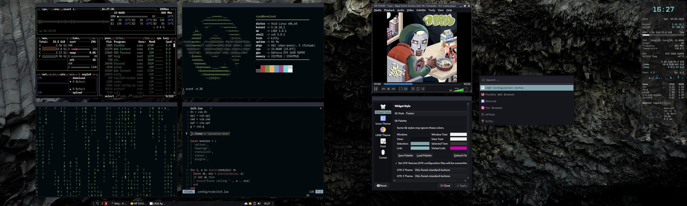

<h2 align="center">CZARHEX DOTFILES</h2>

[](https://forthebadge.com) 
[](https://forthebadge.com) 
[](https://forthebadge.com) 

<br/>
Personal configurations for my main desktop, powered by Void Linux

** **

###### Shell
zshell + [oh-my-zsh](https://ohmyz.sh/) + [powerlevel10k](https://github.com/romkatv/powerlevel10k)

###### Font
* **Terminal:** [IBM Plex Nerd Patch (BlexMono)](https://www.nerdfonts.com/font-downloads)
* **Conky** Liberation Mono + CP Mono
* **Desktop:** Cantarell

###### Themeing
* **GTK 2,3,4:** ---| [Otis \ Forest / Standard buttons](https://www.pling.com/p/1619506)
* **Icons:** ---------| [Qogir-dark](https://www.pling.com/p/1296407)
* **Cursors:** -----| [Phinger-cursors](https://www.pling.com/p/1690782)
* **Openbox:** ----| [Archlabs-Dark](https://github.com/void-linux/void-packages/tree/master/srcpkgs/archlabs-themes)

###### Other
* **Display manager:** LightDM w/ GTK3 greeter && IBM Plex font
* **Screensaver & locker:** light-locker (no longer using i3lock)
* **Mixer:** pavucontrol-qt
* **Caffeine:** caffeine-ng

###### To-do
* Dotfiles install shell script

<br/>

** **

<br/>

### How to: Pipewire (w/ Wireplumber) on Void Linux
* `sudo xbps-install -Sy pipewire alsa-pipewire wireplumber`

* Edit `/usr/share/pipewire/pipewire.conf` like so (usually last lines in config) :
  - ```
    context.exec = [
        { path = "/usr/bin/wireplumber" args = "" }
        { path = "/usr/bin/pipewire" args = "-c pipewire-pulse.conf" }
    ]
    ```

* Run these commands :
  - `sudo mkdir -p /etc/alsa/conf.d`
  - `sudo ln -s /usr/share/alsa/alsa.conf.d/50-pipewire.conf /etc/alsa/conf.d`
  - `sudo ln -s /usr/share/alsa/alsa.conf.d/99-pipewire-default.conf /etc/alsa/conf.d`

* Edit `/etc/pulse/client.conf` :
  - by replacing `; autospawn = yes` with `autospawn = no`

* Add `pipewire &` in your .xinitrc (.xprofile if using LightDM)

* Reboot

** **

<br/>

### LXQt Desktop Screenshot (main)

