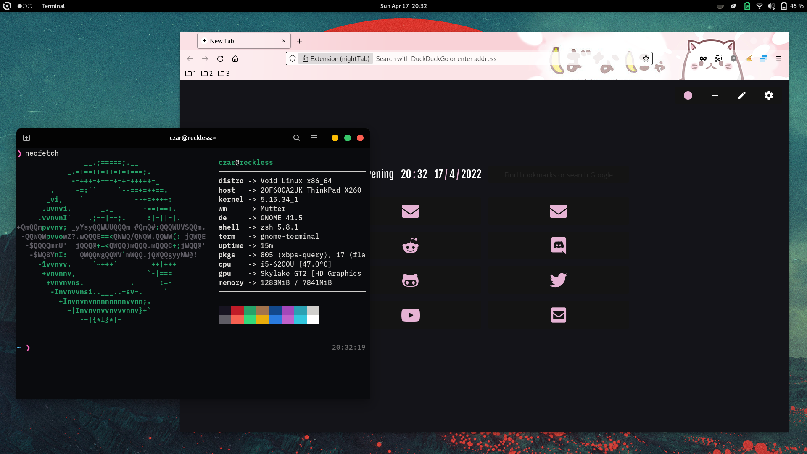
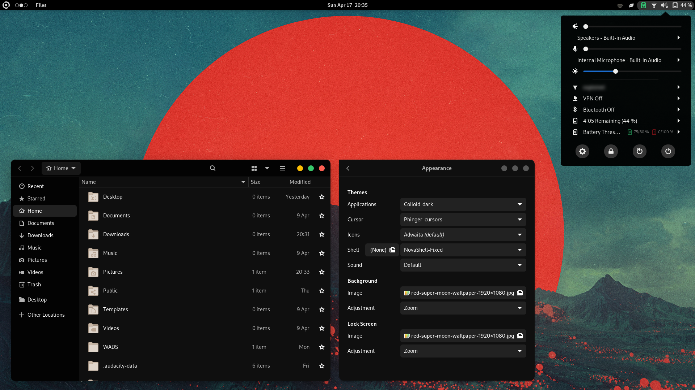
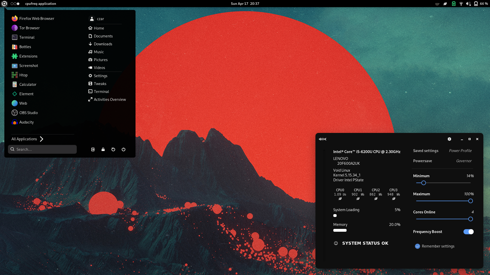
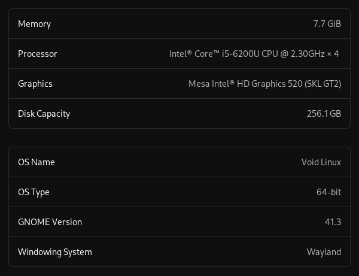

 
Personal configurations for my thinkpad x260 laptop, powered by Void Linux

** **

###### Shell
zshell + [oh-my-zsh](https://ohmyz.sh/) + [powerlevel10k](https://github.com/romkatv/powerlevel10k)

###### Font
* **Terminal:** [IBM Plex Nerd Patch (BlexMono)](https://www.nerdfonts.com/font-downloads)
* **Desktop:** Cantarell

###### Themeing
* **GTK:** -------------| [Colloid-dark (Tweaks: Rimless, Black)](https://www.pling.com/p/1661959)
* **Icons:** ------------| [Adwaita](https://www.youtube.com/watch?v=dQw4w9WgXcQ)
* **Cursors:** --------| [phinger-cursors](https://www.pling.com/p/1690782)
* **Gnome shell:** --| [Nova Shell Fixed](https://www.pling.com/p/1197147)

###### Other
* **Display manager:** GDM
* **Screensaver & locker:** gnome-screensaver
* **Misc:** caffeine-ng, networkmananger-openvpn plugin w/ ProtonVPN, gnome-weather
* **Gnome version:** 41.3 (41.5?)
* **Gnome extensions:**
  - Appindicator support
  - Application Volume Mixer
  - ArcMenu
  - cpufreq
  - Just Perfection
  - Rounded System Menu Buttons
  - Sound Input & Output Device Chooser
  - Thinkpad Battery Threshold
  - User Themes
  - Workspace indicator
  - Removable Drive Menu

** **

 

### GNOME desktop preview (x260)

** **

